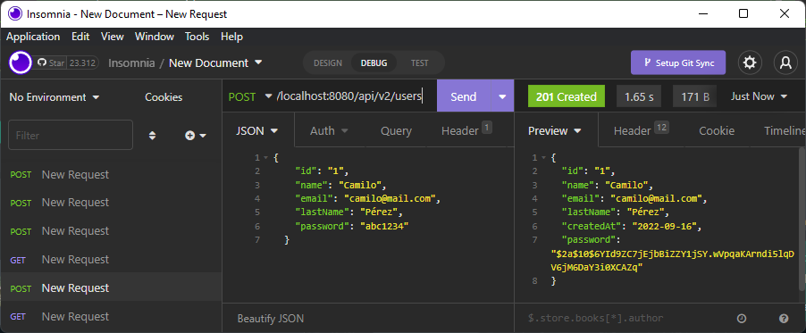

# Laboratorio 3: Spring Boot Seguridad con JWT

## Inovación y Emprendimiento con Tecnologías de Información

#### Camilo Andrés Pichimata Cárdenas

##### Septiembre del 2022

## Objetivos

- Explicar cómo funciona JWT. 

- Implementar la seguridad de los endpoints de la API utilizando JWT.

Nuestros endpoints del API pueden ser utilizados por cualquier persona que conozca la URL y la estructura de la API. Para asegurar nuestra API, implementaremos la autenticación JWT.

## Temas Principales

- Spring Security.

- JWT.

- Token.

## Desarrollo

### Parte 1: Agregar configuración de seguridad

Se agregaron las dependencias especificadas, se agregó la clase y se testearon los endpoints del API, en este caso se retornaron los siguientes códigos de respuesta:

#### - GET, PUT y DEL - (403 Forbidden)


#### - POST - (401 Unauthorized)


### Parte 2: Implementación del controlador de autenticación

Después de agregar y actualizar las clases necesarias con los nuevos atributos y la creación del *AuthController* se agregó temporalmente el siguiente endpoint a la configuración de seguridad:

```java
[...]
.antMatchers( HttpMethod.POST,"/api/v2/users" ).permitAll()
[...]
```

Esto con el fin de agrgar un nuevo usuario para realizar las pruebas, el usuario agregado posee las siguiente caracteristicas:

```json
{
    "id": "1",
    "name": "Camilo",
    "email": "camilo@mail.com",
    "lastName": "Pérez",
    "password": "abc1234"
}
```

Para agregarlo se realizó una petición `POST` a la dirección `http://localhost:8080/api/v2/users` como se puede ver a continuación:



Como se puede ver la inserción se realizó con éxito.

Ahora vamos a realizar la petición del token, para esto debemos al igual que en el paso anterior permitir las conexiones al endpoint `/api/v2/auth` a la configuración de seguridad de la siguiente forma:

```java
[...]
.antMatchers( HttpMethod.POST, "/api/v2/auth").permitAll()
[...]
```

Seguido a esto hacemos una petición `POST` a la dirección `http://localhost:8080/api/v2/auth` con el fin de generar un toquen que nos permita conectarnos a la aplicación como el usuario registrado anteriormente, en el cuerpo de la petición se envía lo siguiente:

```json
{"email": "camilo@mail.com", "password": "abc1234"}
```

En la respuesta se obtiene el token para el usuario junto con su fecha de vencimiento como se puede ver a continuación:


### Parte 3: Implementar filtro de solicitudes JWT

Finalmente y terminadas todas las implementaciones compilamos y ejecutamos el proyecto;
Nuevamente realizamos la petición del token con las credenciales de usuario como se realizó anteriormente:


Antes de utilizar el Token intentamos realizar una petición `GET` a la dirección `http://localhost:8080/api/v2/users` con el fin de obtener el listado de usuarios...


Como se puede observar no se permite realizar la consulta aún debido a que no hemos utilizado el token que se hace necesario para acceder a la aplicación;
Para poder obtener una respuesta satisfactoria debemos tomar el token obtenido, y lo incluimos en el encabezado como se puede ver a continuación, teniendo en cuenta la palabra `Bearer` que hace referencia al token utilizado:


Como se puede ver la petición se realiza con éxito.

Para probar el `delete` se creó un nuevo usuario y se asignaron roles de la siguiente manera


Si generamos un token para el usuario con `id=2` e intentamos eliminar el usuario con `id=1` obtenemos lo siguiente:


Por otro lado si intentamos eliminar el usuario con `id=2` mediante un token generado para el usuario con `id=1` obtenemos lo siguiente:


Lo anterior debido a que se utilizó la anotación `@RolesAllowed("ADMIN")` para el Mapping de `delete` como se ve a continuación:

```java
@DeleteMapping( "/api/v2/users/{id}" )
@RolesAllowed("ADMIN")
public ResponseEntity<Boolean> delete( @PathVariable String id ){
[...]
}
```